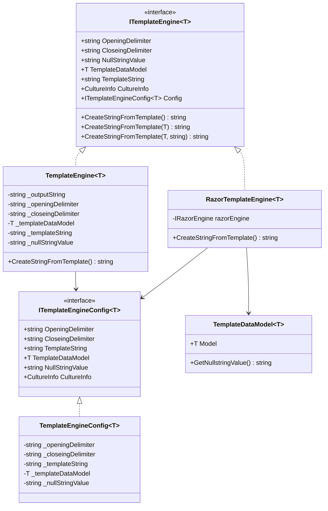
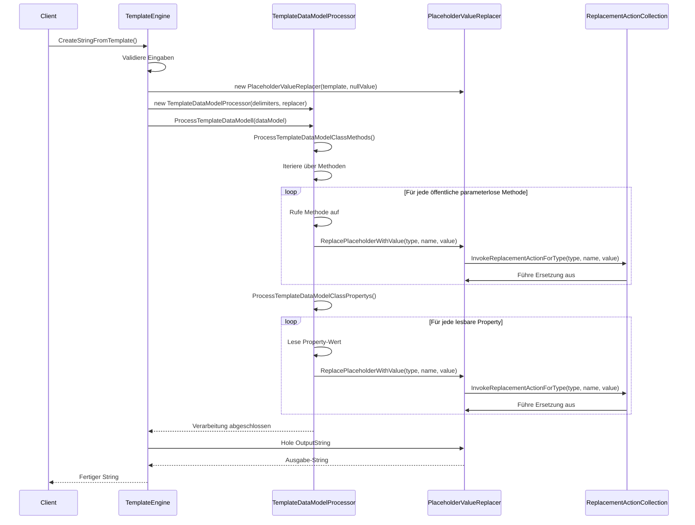
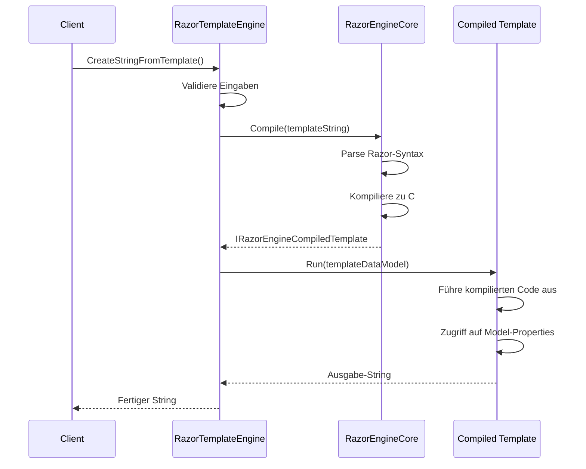

# Architektur-Übersicht

**Commit-Referenz:** 5c37e68  
**Dokumentations-Stand:** Dezember 2025

---

## Inhaltsverzeichnis

1. [Überblick](#überblick)
2. [Architektur-Diagramme](#architektur-diagramme)
3. [Komponenten](#komponenten)
4. [Datenfluss](#datenfluss)
5. [Design-Entscheidungen](#design-entscheidungen)

---

## Überblick

MbSoftLab.TemplateEngine.Core ist eine .NET 8.0 Bibliothek, die zwei verschiedene Template-Engine-Implementierungen bereitstellt:

1. **TemplateEngine<T>** - Einfacher, schneller String-basierter Template-Engine
2. **RazorTemplateEngine<T>** - Komplexer Razor-basierter Template-Engine für HTML (bereitgestellt durch das optionale Paket `MbSoftLab.TemplateEngine.Core.Razor`)

Beide implementieren das gemeinsame `ITemplateEngine<T>` Interface.

---

## Architektur-Diagramme

### Gesamt-Architektur

```mermaid
graph TB
    subgraph "Client Code"
        A[Benutzer-Anwendung]
    end
    
    subgraph "MbSoftLab.TemplateEngine.Core"
        B[ITemplateEngine&lt;T&gt;]
        C[TemplateEngine&lt;T&gt;]
        D[[RazorTemplateEngine&lt;T&gt;]]
        E[TemplateDataModelProcessor]
        F[PlaceholderValueReplacer]
        G[ReplacementActionCollection]
        H[ITemplateEngineConfig&lt;T&gt;]
        I[TemplateEngineConfig&lt;T&gt;]
        J[TemplateEngineExtensions]
    end
    
    subgraph "MbSoftLab.TemplateEngine.Core.Razor (optional)"
        D
        K[RazorEngineCore]
    end
    
    A --> B
    B --> C
    B --> D
    C --> E
    C --> H
    D --> H
    D --> K
    E --> F
    F --> G
    H --> I
    A --> J
    J --> B
```



### Klassen-Hierarchie



### Template-Verarbeitungs-Pipeline (TemplateEngine)



### Template-Verarbeitungs-Pipeline (RazorTemplateEngine)



---

## Komponenten

### 1. Template Engines

#### TemplateEngine<T>
- **Zweck:** Schnelle, einfache String-Template-Verarbeitung
- **Strategie:** Reflection-basierte Platzhalter-Ersetzung
- **Performance:** Sehr gut für einfache Templates
- **Einschränkungen:** Keine Collections, keine komplexe Logik

#### RazorTemplateEngine<T>
- **Zweck:** Komplexe HTML-Template-Generierung
- **Strategie:** Razor-Syntax-Kompilierung
- **Performance:** Gut für komplexe Templates (Kompilierung beim ersten Mal)
- **Vorteile:** Volle C#-Syntax, Schleifen, Bedingungen, etc.

### 2. Datenverarbeitung

#### TemplateDataModelProcessor
- **Verantwortung:** Verarbeitet TemplateDataModel-Klassen
- **Funktionen:**
  - Extrahiert Properties via Reflection
  - Extrahiert parameterlose öffentliche Methoden
  - Filtert Basis-Klassen-Methoden (Blacklist)
  - Delegiert Wert-Ersetzung an PlaceholderValueReplacer

#### PlaceholderValueReplacer
- **Verantwortung:** Ersetzt Platzhalter durch Werte
- **Funktionen:**
  - Verwaltet Output-String
  - Delegiert typ-spezifische Ersetzung an ReplacementActionCollection
  - Handhabt NULL-Werte
  - Wendet CultureInfo für Formatierung an

#### ReplacementActionCollection
- **Verantwortung:** Typ-spezifische Ersetzungslogik
- **Funktionen:**
  - Registriert Actions für jeden unterstützten Typ
  - Wirft NotSupportedException für nicht unterstützte Typen
  - Ermöglicht Erweiterung durch neue Typen

### 3. Konfiguration

#### ITemplateEngineConfig<T> / TemplateEngineConfig<T>
- **Zweck:** Zentrale Konfiguration für Template-Engines
- **Einstellungen:**
  - Delimiter (OpeningDelimiter, CloseingDelimiter)
  - NULL-Wert-String
  - CultureInfo für Formatierung
  - TemplateDataModel und TemplateString

### 4. Erweiterungen

#### TemplateEngineExtensions
- **CreateStringFromTemplateWithJson:** JSON-Deserialisierung + Template-Verarbeitung
- **LoadTemplateFromFile:** Lädt Template-String aus Datei

---

## Datenfluss

### Einfacher TemplateEngine-Ablauf

```
1. Client erstellt TemplateEngine mit DataModel und Template
2. Client ruft CreateStringFromTemplate() auf
3. TemplateEngine erstellt PlaceholderValueReplacer
4. TemplateEngine erstellt TemplateDataModelProcessor
5. Processor verarbeitet Methoden:
   - Findet öffentliche parameterlose Methoden
   - Ruft jede Methode auf
   - Übergibt Ergebnis an Replacer
6. Processor verarbeitet Properties:
   - Iteriert über alle lesbaren Properties
   - Liest jeden Wert
   - Übergibt an Replacer
7. Replacer ersetzt jeden Platzhalter:
   - Prüft Typ
   - Ruft passende ReplacementAction auf
   - Ersetzt im Output-String
8. TemplateEngine gibt fertigen String zurück
```

### RazorTemplateEngine-Ablauf

```
1. Client erstellt RazorTemplateEngine mit DataModel und Razor-Template
2. Client ruft CreateStringFromTemplate() auf
3. RazorTemplateEngine kompiliert Template (falls nicht gecacht)
4. Kompiliertes Template wird mit DataModel ausgeführt
5. Razor-Code greift direkt auf Model-Properties zu
6. Ausgabe-String wird generiert und zurückgegeben
```

---

## Design-Entscheidungen

### 1. Zwei Template-Engine-Typen

**Entscheidung:** Bereitstellung von zwei verschiedenen Engines statt nur einer.

**Begründung:**
- Einfache Templates benötigen keine Razor-Kompilierung (Performance)
- Komplexe Templates profitieren von Razor-Syntax (Flexibilität)
- Gemeinsames Interface ermöglicht austauschbare Nutzung

**Trade-off:** Mehr Code-Wartung, aber bessere Use-Case-Abdeckung

### 2. Reflection-basierte Property-Verarbeitung

**Entscheidung:** Verwendung von Reflection zur Laufzeit für Property-Zugriff.

**Begründung:**
- Keine Code-Generierung notwendig
- Funktioniert mit allen Typen ohne zusätzliche Konfiguration
- Einfache API

**Trade-off:** Geringere Performance als kompilierte Zugriffe, aber akzeptabel für Use-Case

### 3. Typ-spezifische Ersetzungs-Actions

**Entscheidung:** Dictionary mit Actions pro Typ statt generischer Konvertierung.

**Begründung:**
- Präzise Kontrolle über Formatierung pro Typ
- Erweiterbar für neue Typen
- Klare Fehlermeldungen bei nicht unterstützten Typen

**Trade-off:** Mehr initialer Code, aber flexibler und wartbarer

### 4. Immutable Delimiter nach Trim

**Entscheidung:** Delimiter werden getrimmt beim Setzen.

**Begründung:**
- Verhindert Whitespace-Fehler in Templates
- User-freundlicher
- Konsistentes Verhalten

**Trade-off:** Keine exakte Whitespace-Kontrolle möglich (sehr selten benötigt)

### 5. Blacklist für Methoden

**Entscheidung:** Blacklist-basierte Filterung von Basis-Methoden.

**Begründung:**
- Verhindert ungewollte Methoden-Aufrufe (ToString, GetHashCode, etc.)
- Einfach erweiterbar
- Schutz vor unerwünschtem Verhalten

**Trade-off:** Muss bei neuen Basis-Klassen erweitert werden

### 6. .NET 8.0 als Target Framework

**Entscheidung:** Ausschließlich .NET 8.0, keine Multi-Targeting.

**Begründung:**
- Modernste .NET-Features verfügbar
- Bessere Performance
- Einfachere Wartung (nur ein Target)

**Trade-off:** Nicht mit älteren .NET-Versionen kompatibel

---

## Erweiterungspunkte

### Zukünftige Erweiterungsmöglichkeiten

1. **Template-Caching:** Kompilierte Razor-Templates cachen für bessere Performance
2. **Async-Support:** Asynchrone Template-Verarbeitung
3. **Collection-Support in TemplateEngine:** Iteration über Listen direkt im Template
4. **Methoden mit Parametern:** Unterstützung für Methoden-Aufrufe mit Argumenten
5. **Custom Type Formatters:** Benutzer-definierte Formatierung für eigene Typen
6. **Template-Vererbung:** Include/Import von Templates
7. **Partial Templates:** Wiederverwendbare Template-Fragmente

---

**Letzte Aktualisierung:** Dezember 2025  
**Commit-Referenz:** 5c37e68
